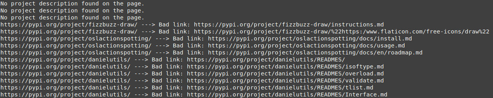

# Batch_Check_PyPI_Relative_Paths

Inspired by [PyPI_Relative_Path_Check](https://github.com/KPCOFGS/PyPI_Relative_Path_Check)

This Python script checks the relative paths from projects on the PyPI search results pages for Python3 projects. It fetches a specified number of pages and checks all the relative paths in the project descriptions.

## How it works

The script uses the `requests` and `BeautifulSoup` libraries to fetch and parse the HTML content of the pages. It then finds all the relative paths in the project descriptions and checks if they are valid. If a relative path is not valid, it prints a message with the URL of the bad link.

## Example



## Download

You can download the script using `git`

```bash
git clone https://github.com/KPCOFGS/Batch_Check_PyPI_Relative_Paths.git
cd Batch_Check_PyPI_Relative_Paths
```

You can install the dependencies using pip:

```bash
pip install -r requirements.txt
```

## Usage

You can run the script from the command line with the `--pages` argument to specify the number of pages to check:

```bash
python script.py --pages PAGE_NUMBER
```

## LICENSE

This repository is licensed under the [Unlicense](LICENSE)
